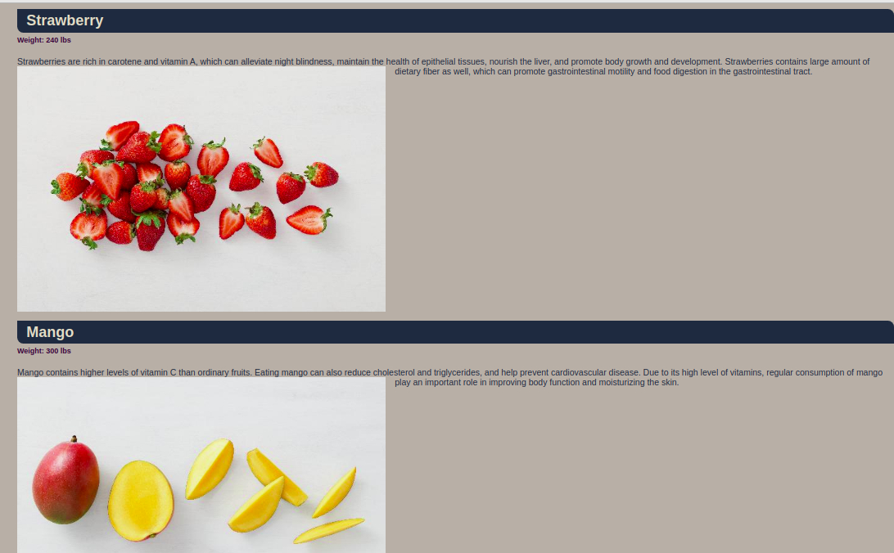
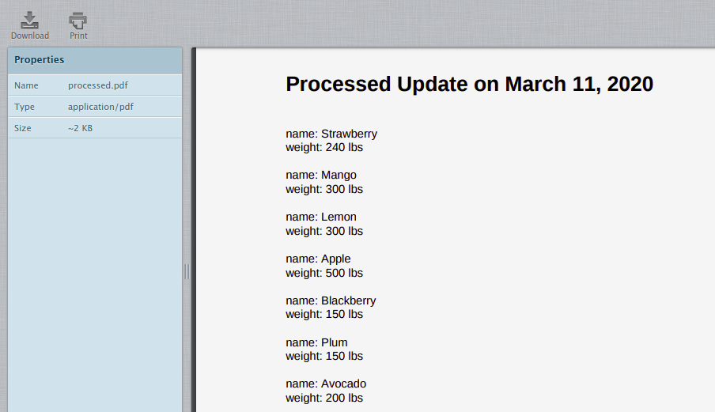

# Fruits Store Catalog

Automate updating catalog information.

## What does this project do?
1. Write a script that summarizes and processes sales data into different categories
2. Generate a PDF using Python
3. Automatically send a PDF by email
4. Write a script to check the health status of the system

## Get Started
1. Clone this repository
2. Check all TO-DOs in this project. Be sure to follow all TO-DOs to run this project. Details for every python file are listed below.
3. Done

## Files Explanation

### [`changeImage.py`](changeImage.py)
This script will: 
1. Convert all `TIFF` images in [images folder](supplier-data/images) to `JPEG` format.
2. Resize all images to 600 * 400 px
3. Save the new converted images.

### [`supplier_image_upload.py`](supplier_image_upload.py)
This script will:
1. Take all converted images in [images folder](supplier-data/images) to upload it on web server.
2. To upload all images, it will use `POST` method to `url` variable.

### [`run.py`](run.py)
This script will:
1. Make a JSON (actually just a dictionary LOL) of [all supplier descriptions](supplier-data/descriptions). The JSON will be like this:
```markdown
{
    "name": "Watermelon", 
    "weight": 500, 
    "description": "Watermelon is good for relieving heat, eliminating annoyance and quenching thirst. It contains a lot of water, which is good for relieving the symptoms of acute fever immediately. The sugar and salt contained in watermelon can diuretic and eliminate kidney inflammation. Watermelon also contains substances that can lower blood pressure.", 
    "image_name": "010.jpeg"
}
```
2. After that, the JSON will be `POST`ed to web server (`url` variable)
3. After posting it to web server, the web will load the data and show it like this


### [`reports.py`](reports.py)
This script will:
1. Generate a PDF report. The report will be like this:


### [`emails.py`](emails.py)
This script will:
1. Generate email with attachment
2. Generate email without attachment
3. Send the generated email

### [`report_email.py`](report_email.py)
This script will:
1. Write summary in PDF file
2. Combine [`reports.py`](reports.py) and [`emails.py`](emails.py)
3. Send the reports to email

### [`health_check.py`](health_check.py)
This script will:
1. Report an error if CPU usage is over 80%
2. Report an error if available disk space is lower than 20%
3. Report an error if available memory is less than 500MB
4. Report an error if the hostname "localhost" cannot be resolved to "127.0.0.1"
5. Email the report

To make sure this script run, follow the steps below: 
1. Type `sudo apt install stress` to install stress to you computer.
2. Type `stress --cpu 8` to make your CPU more stress (even if your CPU is already tired jk)
3. Type `./health_check.py` in other cmd to run the script and you will receive email because your CPU is stress. Please go to psychiatrist.
